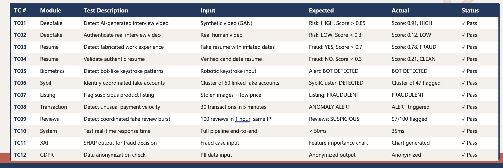

# SECURE ACCESS AI: Comprehensive Test Cases

This document outlines the core test cases designed to validate the **Secure Access AI (Project Jyoti)** ecosystem. These tests cover biometric ingestion, zero-trust tracking, AI threat heuristics, and real-time dashboard responsiveness.

---

## 1. Biometric & Identity Verification

**TC-01: Successful Biometric Scan & Tokenization**
- **Prerequisite:** Visitor details are pre-registered, or system allows guest registration.
- **Action:** Visitor stands in front of the "SmartScan Terminal".
- **Expected Result:** Ensure facial landmarks are processed securely. System generates `BiometricHash`, verifies the identity, assigns a `VisitorToken`, and transitions state to "ACCESS GRANTED". Check that local state updates immediately.

**TC-02: Liveness Detection Rejection**
- **Prerequisite:** System Config "Liveness Detection" is turned ON.
- **Action:** Attempt to scan a static photo or digital screen representation of a registered visitor's face at the terminal.
- **Expected Result:** The sensor classifies the scan as `biometricOk: false`, triggers a "Spoof Attempt" alert, and denies access.

---

## 2. Zone Control & Behavioral Heuristics

**TC-03: Authorized Zone Transition**
- **Action:** Registered visitor transitions from "Reception" to "Zone-A" (authorized).
- **Expected Result:** System observes `ZONE_CHANGE` event. Visitor’s physical indicator moves gracefully on the `FloorPlan` heatmap. No alerts are generated.

**TC-04: The "Wandering Visitor" (Unauthorized Zone Entry)**
- **Action:** Visitor authorized only for "Reception" is simulated to enter "Server Room" (Level 4, Breach).
- **Expected Result:** System instantaneously calculates authorization mismatch. Real-time telemetry detects it, throws a `CRITICAL` alert on the "Monitoring Queue" (Dashboard), and flashes red.

**TC-05: Passback Violation**
- **Action:** Transmit two back-to-back check-in/scan events from distant facility nodes using the exact same `idToken` within an impossible time window (e.g., Node 1 and Node 4 within 5 seconds).
- **Expected Result:** The Security Alerts Engine computes the spatial-temporal distance, flags it as a "Passback Anomaly", suspends the credentials globally, and alerts the Guard View.

---

## 3. Physiological & Sentiment Threat Detection

**TC-06: Normal Sentiment Processing**
- **Action:** Trigger telemetry payload with `thermal: 36.6` and `sentiment: 'Calm'`.
- **Expected Result:** Visitor continues movement loop. No change to Security Score `S`.

**TC-07: High-Agitation Behavioral Alert**
- **Action:** Push telemetry payload overriding a visitor’s `sentiment` parameter to `'Agitated'` continuously for 10 seconds.
- **Expected Result:** Security Score crosses threshold. Visitor is marked as `flagged: true` with a `WARNING` or `HIGH` severity. The "GuardView" interface immediately displays the visitor with a highlighted red indicator.

**TC-08: Thermal Escalation Trigger**
- **Action:** Push telemetry event overriding visitor’s core temperature reading to `thermal: 38.5` (Fever/Exertion).
- **Expected Result:** AI engine trips a `HEUR_THERMAL_WARNING`. UI generates an `AI_PREDICTED` or `CRITICAL` global threat alert, pulsing the indicator on the Spatial Grid.

---

## 4. Security Command & Global Sync

**TC-09: Live Settings Deployment (SystemConfig)**
- **Action:** Administrator navigates to System Config and changes the "Face Match Sensitivity" slider and toggles "Auto PDF Generation".
- **Expected Result:** Verify that hitting "Save Changes" propagates configuration changes continuously to `localStorage` and `securityEngine`. Re-evaluating terminal scans should now abide by the new sensitivity threshold.

**TC-10: Immediate Incident Broadcast**
- **Action:** From the GuardView "Comms Channel", a guard clicks "Broadcast Alert" -> "Evacuate".
- **Expected Result:** Ensure the global `triggerBroadcast` updates `SecurityContext`. The Dashboard and GuardView instantly render a high-priority banner at the top of the screen (Level: DANGER).

**TC-11: Incident Escalation & Resolution Cycle**
- **Action:** A "CRITICAL" Server Room alert generates. 
- **Expected Result:** 
  1. The Alert appears in state `NEW` on the Monitoring Queue.
  2. Analyst clicks "Acknowledge Thread" within 30 seconds.
  3. Alert status upgrades to `ACKNOWLEDGED` (grayscale).
  4. Analyst clicks "Generate PDF Report" when resolved to execute `generateIncidentReport()` hook.

---

## 5. Audit Log Resilience

**TC-12: Audit Log Integration**
- **Action:** Generate multiple visitor scenarios (safe, flagged, varying zones). Navigate to the "Audit Logs" tab.
- **Expected Result:** All visitor data from the persistent context is mapped securely into the table. Verified properties (`idToken`, `purpose`, `sentiment`, `status`) display precisely.
- **Action:** Utilize the Search bar and filter tabs.
- **Expected Result:** Instantly filters thousands of tracked behaviors dynamically traversing the global array without crashes.
